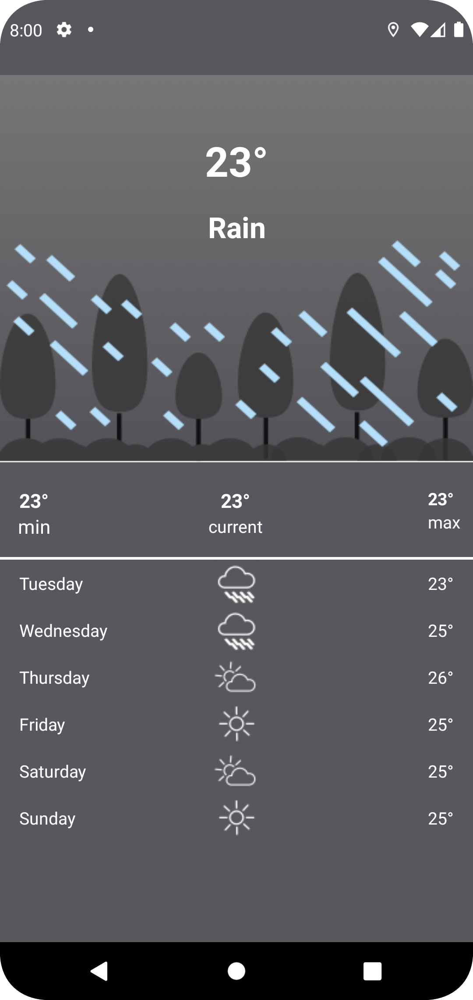
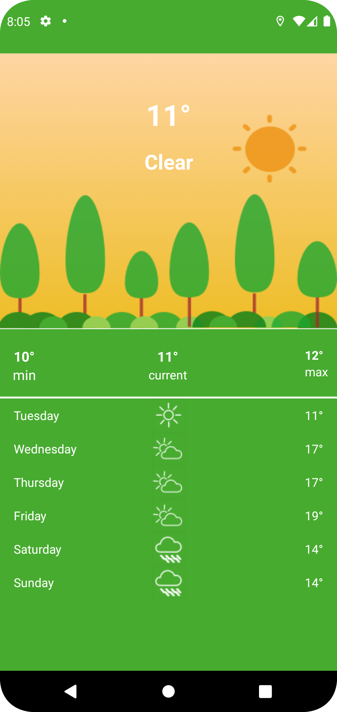
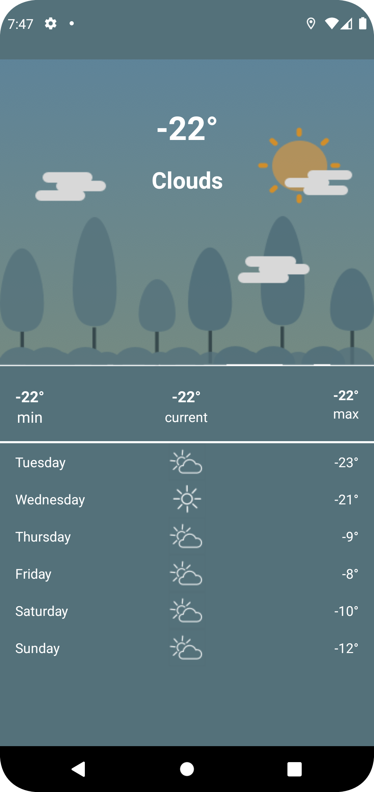

# WeatherApp

This is an android app that fetches current weather and weather forecast for the current gps location.

## Development Environment

* Android Studio Bumblebee | 2021.1.1 Patch 2 or Higher
* Language: Kotlin
* Build System: Gradle

## Architecture

The application uses a combination of Clean Architecture, Model View view Model and Repository Pattern.

### Clean Architecture

Clean architecture helps organizing the project into different layers so that it's easy to understand, scale , debug and manage complexities. It was proposed by [Robert C. Martin](https://en.wikipedia.org/wiki/Robert_C._Martin)
in 2012 in the [Clean Code Blog](http://blog.cleancoder.com/uncle-bob/2012/08/13/the-clean-architecture.html) and it follow the SOLID principle. For smaller apps this is not something to be worried about, however in has proven useful
when working on apps with longer development and bigger teams. In android here are [Multiple ways of defining Clean Architecture layers](https://proandroiddev.com/multiple-ways-of-defining-clean-architecture-layers-bbb70afa5d4a).

### Why Clean Architecture?

* Loose coupling between the code - The code can easily be modified without affecting any or a large part of the app's codebase thus easier to scale the application later on.

* Easier to test code.
* Separation of Concern - Different modules have specific responsibilities making it easier for modification and maintenance.

### Layers

### 1. Domain

This is the layer that contains all the business logic. This layer is independent from any other layer hence changes is any layer e.g database would not affect the domain layer
. In this project the domain layers holds the definitions of use-cases/interactors, domain data models and repository interfaces.

```usecases/ interactors```  they are the business logic executors that converts and passes user actions like fetch data from data source either remote or local and gives it back to the requester, in this case its the presenter (app).
This act as mediators between the repository and data layer

```repository interface``` interface that must be implemented by data layer

```models``` Defines the core structure of the data that will be used within the application.

### 2. Data

The data layer is responsible for providing data to the domain layer. It contains the implementations of the repositories declared in the domain layer.

`:data:network` Handles data interacting with the network

`:data:local` Handles persistence of data locally i.e provides local caching mechanism

`:data:repository` Exposes the data to the domain layer abstracting the source of data.

`mappers` performs data transformation between the layers models

`models`

* ```Dto``` defines model and responses from the network
* ```Entities``` defines model/schema of the Database

### 3. Presentation

The presentation layer contains components involved in showing information to the user. The main part of this layer are the views(activity) and viewmodels.

## Testing

```domain``` in the domain layer test is done using ```JUnit4``` to the use cases. Fake Repository to interact with the Use Case to assert that the correct data is returned

```data``` in this layer test to the daos, api and mappers.

* api is tested using ```webmockserver```. This enables us to test if the converter and the correct data is returned in each case.
* dao is tested using ```room in memory database```. This allows us to test the interaction with the dao and database
* mappers test is used to certify that the mapper maps the correct data and returns the correct type.

```app``` in this layer test the mappers, viewmodel and Activity.

# Libraries

* [Android Jetpack](https://developer.android.com/jetpack)
  * [Data Binding](https://developer.android.com/topic/libraries/data-binding/) The Data Binding Library is a support library that allows you to bind UI components in your layouts to data sources in your app using a declarative format rather than programmatically.
  * [Live Data](https://developer.android.com/topic/libraries/architecture/livedata) LiveData is lifecycle-aware, meaning it respects the lifecycle of other app components updating app component observers that are in an active lifecycle state.

* [Kotlin coroutines](https://developer.android.com/kotlin/coroutines) Executing code asynchronously.
* [Retrofit](https://square.github.io/retrofit/) Type-safe HTTP client for Android and Java and Kotlin by Square, Inc.
* [Gson](https://github.com/square/retrofit/tree/master/retrofit-converters/gson) A Converter which uses Gson for serialization to and from JSON.
* [OkHttp interceptor](https://github.com/square/okhttp/tree/master/okhttp-logging-interceptor) Logs HTTP requests and responses
* [Material Design](https://material.io/develop/android/) Build beautiful, usable products using Material Components for Android
* [JUnit4](https://junit.org/junit4/) Unit Testing
* [Espresso](https://developer.android.com/training/testing/espresso) Automated testing UI test
* [MockWebServer](https://github.com/square/okhttp/tree/master/mockwebserver) A scriptable web server for testing HTTP clients
* [Kakao](https://github.com/KakaoCup/Kakao) Nice and simple DSL for Espresso in Kotlin
* [MockK](https://mockk.io/) Mocking Library for Kotlin
* [jacoco](https://github.com/jacoco/jacoco) - a Code Coverage Library.

# Secrets

Secrets are stored in  `secrets.properties` found in the `data/repository` folder. Create/ Edit the file and set the BEARER_TOKEN with the given token.

```
// data/repository/secrets.properties
BEARER_TOKEN = ""
```

This helps hide the secrets from the repository

> For CI/CD, this project uses Github Actions, add BEARER_TOKEN to the repository secrets to have the workflow get the key from there while running

# Demo

|
|
|
|
|

# References

## Articles

* [Why do we need Clean Architecture?](https://www.droidcon.com/media-detail?video=481190265)
* [detailed-guide-on-android-clean-architecture](https://medium.com/android-dev-hacks/detailed-guide-on-android-clean-architecture-9eab262a9011)
* [clean-architecture-tutorial-for-android-getting-started](https://www.raywenderlich.com/3595916-clean-architecture-tutorial-for-android-getting-started#toc-anchor-013)
* [Multiple ways of defining Clean Architecture layers](https://proandroiddev.com/multiple-ways-of-defining-clean-architecture-layers-bbb70afa5d4a)

## Codelabs

* [Testing](https://developer.android.com/codelabs/advanced-android-kotlin-training-testing-basics#7)
